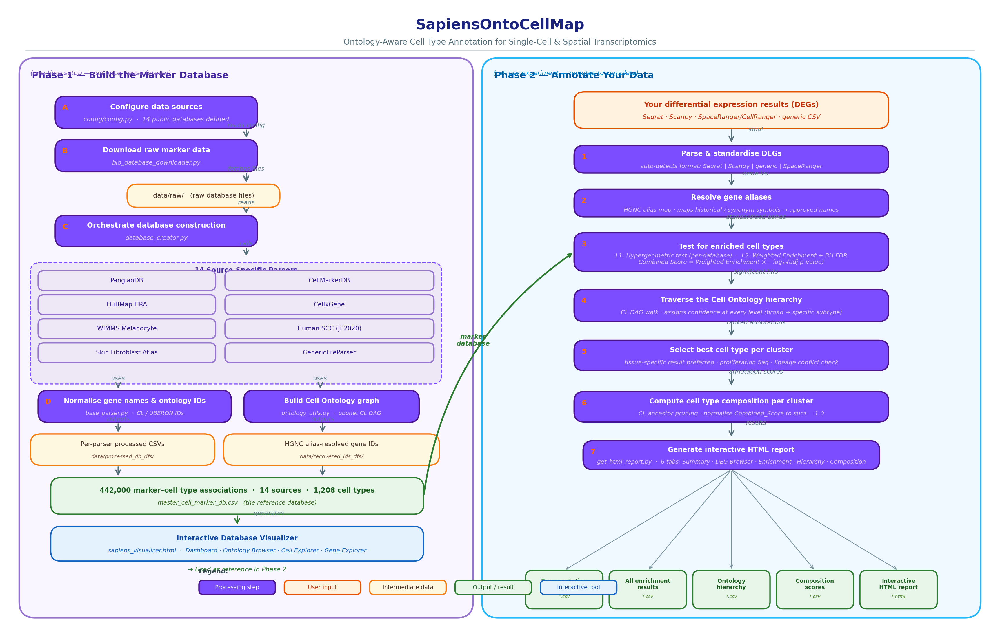

# SapiensOntoCellMap

Ontology-aware hierarchical cell type annotation for single-cell and spatial transcriptomics.

   [](https://doi.org/10.5281/zenodo.20091879)

---

## Overview

SapiensOntoCellMap annotates cell clusters from scRNA-seq and spatial transcriptomics experiments using a consolidated, ontology-normalized marker database built from 14 curated public sources (442,000 marker–cell type associations, 22,469 genes, 1,208 cell types, 266 tissues). Annotation is performed via hypergeometric enrichment testing with Benjamini–Hochberg global FDR correction and evidence-weighted scoring, without requiring a reference atlas or pre-trained model.

The key differentiator is Cell Ontology (CL) graph traversal at annotation time. For every significant hit, SapiensOntoCellMap walks the CL DAG from the matched node up to the ontology root, recording confidence at every ancestor level. This yields a hierarchical annotation — from broad lineage (e.g., lymphocyte) down to specific subtype (e.g., CD8-positive, alpha-beta cytotoxic T cell) — with a single enrichment run. No existing tool delivers this for both scRNA-seq and spatial data without a reference atlas.

Supported inputs: Seurat `FindAllMarkers()` CSV, Scanpy `rank_genes_groups` export, SpaceRanger/CellRanger analysis folders, and generic CSV from any platform.

---

## Architecture Diagram



**Figure 1.** SapiensOntoCellMap pipeline. Phase 1 (left): one-time marker database construction from 14 curated sources. Phase 2 (right): per-experiment cell type annotation via weighted enrichment testing and CL ontology traversal.

---

## Installation

Requires Python >= 3.10.

```bash
git clone https://github.com/Sonal1510/SapiensOntoCellMap.git
cd SapiensOntoCellMap
uv venv && uv pip install -e .
# or: pip install -e .
```

---

## Build the Marker Database (one-time setup)

```bash
python scripts/build_marker_db.py
```

Downloads and parses all 14 source databases (~10–20 minutes, internet required). Output:

- `data/processed_combined_db/master_cell_marker_db.csv` — 442K-row master database
- `data/reference/hgnc_complete_set.txt` — HGNC gene alias map
- `data/processed_combined_db/quarantine_log.csv` — schema violation log

To rebuild from cached raw files without re-downloading:

```bash
python scripts/build_marker_db.py --skip_download
```

---

## Quick Start

### scRNA-seq (Seurat DEG CSV)

```bash
python src/cluster_annotation/get_cluster_annotation.py \
    path/to/seurat_degs.csv \
    my_experiment \
    results/ \
    --deg_type scrna
```

### Spatial transcriptomics (SpaceRanger output folder)

```bash
python src/cluster_annotation/get_cluster_annotation.py \
    path/to/spaceranger_out/ \
    my_visium \
    results/ \
    --deg_type spatial \
    --tissue skin
```

### Generic CSV (any platform)

```bash
python src/cluster_annotation/get_cluster_annotation.py \
    degs.csv \
    my_sample \
    results/ \
    --deg_type spatial \
    --deg_format generic
```

---

## Input Formats

| Format | `--deg_type` | `--deg_format` | Notes |
|---|---|---|---|
| Seurat `FindAllMarkers()` CSV | `scrna` | auto-detected | columns: gene, avg_log2FC, p_val_adj, cluster |
| SpaceRanger/CellRanger analysis folder | `spatial` | — | reads `differential_expression.csv` from graphclust or kmeans |
| Scanpy `rank_genes_groups` CSV | `spatial` | auto-detected | columns: names, pvals_adj, logfoldchanges, group |
| Generic CSV (any platform) | `spatial` | `generic` | needs: Feature Name, Cluster N Log2 fold change, Cluster N Adjusted p value |

---

## Outputs

| File | Description |
|---|---|
| `*_top_annotation_summary.csv` | Top cell type per cluster: cell type, CL ID, confidence, broad type, N databases |
| `*_all_tissue_level2_sig_results.csv` | All significant enrichment results (weighted scores, p-values) |
| `*_all_tissue_level2_hierarchical.csv` | Full CL ontology hierarchy traversal per cluster |
| `*_composition_scores.csv` | Per-cluster cell type composition (normalised to sum 1.0) |
| `*_report.html` | Interactive self-contained HTML report (6 tabs) |

### Report tabs

| Tab | Contents |
|---|---|
| Cell Type Summary | Top annotation per cluster, UMAP (auto-detected for spatial), marker gene heatmap |
| DEG Browser | Per-cluster DEG table with p-value, fold-change, and mean-counts filters |
| Enrichment Visuals | Clustered heatmap (adj p < 0.05), p-value violin, log2FC violin, mean-counts box |
| Hypergeometric Result | Full and significant results tables (Level 1 and Level 2) |
| Hierarchy | Icicle chart of CL ontology traversal with confidence scores at each ancestor node |
| Composition | Annotation-derived cell type composition scores per cluster (stacked bar + table) |

---

## Benchmarking

### Datasets

| Dataset | Platform | Clusters | Ground-truth source |
|---|---|---|---|
| PBMC3k | 10x Chromium scRNA-seq (CellRanger 1.1.0) | 8 | Seurat tutorial labels |
| Atera WTA Preview — FFPE Breast Cancer | 10x Atera whole-transcriptome in situ | 31 | 10x Genomics published cell groups (20 types) |

### Accuracy

| Dataset | Top-1 Accuracy | Broad-type Accuracy |
|---|---|---|
| PBMC3k | 88% | 100% |
| Atera Breast Cancer | 85% | — |

Accuracy = fraction of clusters where SapiensOntoCellMap `Top_Cell_Type` or `Broad_Type` shares at least one word token with the published ground-truth label.

### Reproduce benchmarking

```bash
# Download benchmark datasets
python benchmarking/download_datasets.py

# Run annotation
python benchmarking/run_sapiensonto.py

# Generate comparison figures
python benchmarking/comparison_figure.py
```

---

## CLI Reference

| Argument | Default | Description |
|---|---|---|
| `input_path` | required | Path to DEG CSV or SpaceRanger output directory |
| `sample_name` | required | Sample name used as prefix for all output files |
| `output_dir` | required | Directory for output files |
| `--deg_type` | required | `scrna` or `spatial` |
| `--tissue` | None | Filter marker DB by tissue substring (e.g., `skin`, `breast`, `blood`) |
| `--deg_format` | auto | Force DEG format: `seurat`, `scanpy`, or `generic` |
| `--marker_db` | config path | Path to `master_cell_marker_db.csv` |
| `--hgnc_map` | config path | Path to HGNC complete set file for gene alias resolution |
| `--pval` | 0.05 | Adjusted p-value threshold for DEG filtering |
| `--log2fc` | 1.0 | log2 fold-change threshold (consider 0.5 for spatial data at low resolution) |
| `--min_overlap` | 2 | Minimum gene overlap to report |
| `--min_db_markers` | 5 | Minimum marker genes a cell type must have in the background to be tested |
| `--min_cluster_degs` | 0 | Minimum cluster DEG count; clusters below this fall back to unweighted scoring |
| `--tissue_priority_ratio` | 0.0 | Tissue-specific score must exceed this fraction of all-tissue score to take priority (0.0 = hard priority; recommended: 0.3) |
| `--background_gene_count` | auto | Override hypergeometric background N |
| `--no_hierarchy` | — | Skip CL ontology hierarchical annotation |
| `--no_deconvolution` | — | Skip composition scoring (omits Composition tab from report) |
| `--no_auto_spatial_filter` | — | Disable auto-calibration of mean-counts threshold for spatial data |
| `--umap_csv` | None | UMAP coordinates CSV for scRNA-seq (columns: Barcode, UMAP-1, UMAP-2) |
| `--cell_cluster_csv` | None | Cluster assignments CSV for scRNA-seq (columns: Barcode, Cluster) |

Default paths for `--marker_db` and `--hgnc_map` are resolved from `config/config.py` after running `build_marker_db.py`.

---

## Statistical Methods

| Metric | Definition |
|---|---|
| `adj_p_value` | Benjamini–Hochberg corrected hypergeometric p-value (global FDR across all cluster × cell type pairs) |
| `Enrichment_ratio` | (k/n) / (K/N) — observed vs. expected overlap fraction |
| `Weighted_Recall` | W_overlap / W_ref — fraction of total reference evidence weight captured |
| `Weighted_Enrichment` | (W_overlap/n) / (W_ref/N) — weighted analog of enrichment ratio |
| `Combined_Score` | Weighted_Enrichment × −log10(adj_p_value) — ranking metric (not a test statistic) |
| `N_Databases` | Number of independent databases contributing at least one overlapping marker gene |

Evidence weighting: Experiment (1.0) > Single-Cell Sequencing (0.9) > Company (0.8) > Literature (0.7) > Review (0.6) > Computational (0.5).

Full documentation: [`docs/STATISTICAL_METHODS.md`](docs/STATISTICAL_METHODS.md)

---

## Project Structure

```
SapiensOntoCellMap/
├── config/
│   └── config.py                     # DATABASE_CONFIG, paths, constants
├── data/
│   ├── raw/                          # Auto-downloaded source files
│   ├── reference/                    # HGNC alias map
│   └── processed_combined_db/        # master_cell_marker_db.csv + visualizer HTML
├── docs/
│   └── STATISTICAL_METHODS.md        # Complete statistical reference
├── src/
│   ├── parser/                       # Per-database parsers + ontology utilities
│   ├── db_manager/                   # DatabaseCreate orchestrator, DatabaseValidator
│   ├── download/                     # BioDataDownloader
│   ├── cluster_annotation/           # Annotation engine + HTML report
│   │   ├── get_cluster_annotation.py     # CLI entry point
│   │   ├── get_marker_enrichment_test.py # Hypergeometric enrichment engine
│   │   ├── get_html_report.py            # HTML report (6 tabs)
│   │   └── hierarchical_annotation.py    # CL ontology traversal
│   └── visualization/                # Interactive database explorer
│       └── db_process.py                 # CSV → JSON → sapiens_visualizer.html
├── benchmarking/
│   ├── download_datasets.py          # Download PBMC3k and Atera benchmark datasets
│   ├── run_sapiensonto.py            # Run annotation on benchmark datasets
│   └── comparison_figure.py          # Generate benchmarking figures
├── scripts/
│   └── build_marker_db.py            # Download + build + validate the marker database
├── pyproject.toml
└── requirements.txt                  # Pinned environment snapshot
```

---

## Citation

```bibtex
@software{sapiensontocellmap2026,
  author = {Rashmi, Sonal},
  title  = {SapiensOntoCellMap: Ontology-Aware Cell Type Annotation for Single-Cell and Spatial Transcriptomics},
  year   = {2026},
  url    = {https://github.com/Sonal1510/SapiensOntoCellMap}
}
```

For questions, contact: sonalrashmi1510@gmail.com
